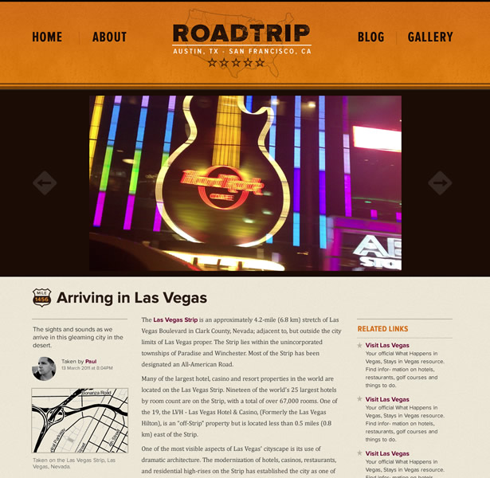
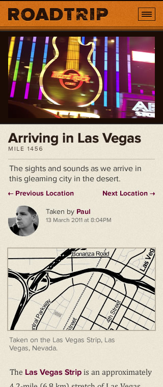
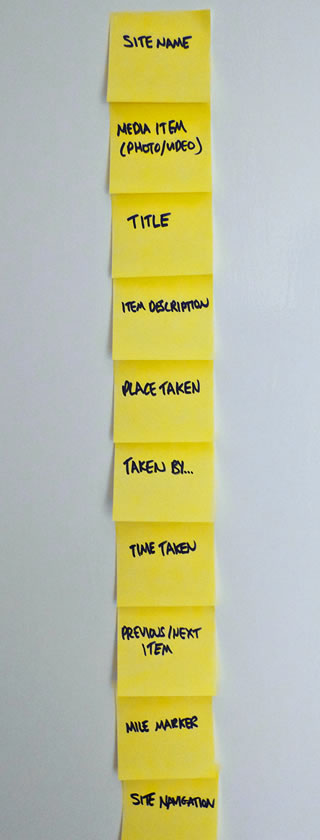

# Build a Responsive Website in a Week
## Day 1: Designing Responsively

Interested in responsive web design but not sure how to get started? Don't fret, help is at hand! As part of Responsive Week, we've asked Clearleft's Paul Robert Lloyd to talk us through the responsive design process, soup to nuts.

* * * 

* **Knowledge needed**: Intermediate CSS and HTML
* **Requires**: Text editor, modern browser, graphics software
* **Project time**: 1 hour (5 hours total)

* * * 

It seems everyone is talking about responsive web design these days, and with good reason; as the number of web-enabled devices continues to grow – each with differing capabilities and features – it's no longer sensible to build fixed-width websites.

Truth is, it never was. Yet until now it was considered best practice to design experiences that made a number of assumptions, be they around screen resolution, bandwidth or input method. If you've ever designed a 960px-wide website, only to view it on a friend's small screen netbook (and yes, I'm writing from painful experience here), you'll understand why this wasn't a particularly clever approach. Now, with smartphones and tablets thrown into the mix, it's clear that our traditional methods are no longer fit for purpose.

Thankfully, the advent of CSS media queries and a growing acknowledgement that the web is a medium in its own right, means we're starting to embrace the true nature of the platform, accepting that its universality is a strength, not a weakness.

Over the next five days, I'll guide you through a technique that recognises this fact: *[responsive web design](http://alistapart.com/articles/responsive-web-design)*. Developed by [Ethan Marcotte](http://ethanmarcotte.com/), this combines fluid layouts, flexible images and media queries to help us build sites that gracefully adapt to any environment they encounter.

I'll demonstrate this approach by showing you how to build a simple media gallery. In my examples, I'll be creating a small website to document a recent road trip I took across the United States, but feel free to customise the code and design to suit your own needs.

* * * 

## Designing for the unknown
Much of this tutorial will centre around the development aspect of responsive design. But before we dig into any code, let's take a moment to think how we might design a website that could conceivably have infinite layouts.

Now, I'm lucky in that I can design interfaces *and* develop the front-end code that makes them real. This isn't a unique skill of course – if you work for yourself then you're probably the same. But it's certainly advantageous to understand how content can adapt and reflow when crafting fluid designs.

I also work as part of a larger team where my role is more specialised. In such an environment, the visual designer can become focused solely on translating wireframes into attractive, engaging (signed-off, pixel-perfect) comps. And it's not unusual for developers to be located separately, translating these layouts into lean and efficient markup and CSS.

However, such linear and segregated workflows quickly break down once we start evaluating how designs will adapt to differing environments. As much as any new tool or technology, we should also [consider more collaborative and agile ways of working](http://24ways.org/2011/collaborative-development-for-a-responsively-designed-web). Many of the trickiest problems encountered when designing responsive websites can be resolved simply through conversation, experimentation and iteration.

## A pragmatic approach to design
That's not to say there isn't scope for designers to think about how a design may work outside the confines of any particular device.

At [Clearleft](http://clearleft.com/), we initiate visual design from the perspective of the desktop. We begin by defining an overarching design language and visual aesthetic, often basing initial explorations around a core piece of content. For example, if we are designing a food site, we'll start with a recipe page; for a news site, a story page.

Not only is this an important page on the site, but it probably includes enough structured content for us to build up a typographic palette. We'll also think about how the layout may adapt – even if it's just in the back of our minds at this stage.

▲ _For our media gallery example, I started by looking at the requirements of the media item page. Once I was happy with the grid, type and visual treatment, I moved on to the design of the homepage._

One useful way to stress test a design is to take such a page and adapt it for a narrower (~320px wide) screen. You'll likely discover that some aspects of the design will need to be rethought for them to work at this width. Here are some examples:

* **Typography:** Large headings can work well on wider layouts, but on smaller screens they can take up a lot of vertical space and therefore require additional scrolling. As line lengths alter, you should consider line heights and other typographic treatments too.

* **Links:** How will your design work on touchscreen devices? While we don't have an easy way to detect these yet (meaning we should take touch into account in all aspects of our design), designing for a narrower screen can give us an opportunity to think about target areas for links and other interactive elements. The iOS guidelines recommend that these be at least 44 pixels/points square, which is a good figure to aim for.

* **Navigation:** This will probably be the most awkward component of any responsive design, especially if your site has many sections and a deep hierarchy. Brad Frost has written [a summary of different approaches to navigation](http://bradfrostweb.com/blog/web/responsive-nav-patterns/) currently being considered.

* **Superfluous content:** Is some content not required? Does other content only need to be shown in certain scenarios? I don't advocate hiding content based on what device a user happens to be using, but techniques like conditional loading (which we'll look at later this week) can help us serve up smaller pages that only load complementary content when required.

▲ _Creating a narrower layout helps us stress test a design._

Designing two contrasting layouts reinforces the idea that a design will adapt, while ironing out potential gotchas early on. While this sounds like a doubling up of work, bear in mind that we are not designing every page to pixel-perfect precision. Instead, we're focusing on building a scalable design language – one that will evolve as we start to implement it in code, and one that is based around individual modules and components.

## Becoming layout agnostic
Unsurprisingly, for an industry that has historically treated the web like print, fixed-width layouts have permeated many of the deliverables we produce. As we begin designing for an adaptable medium, new approaches are being considered that allow us to solve problems and communicate ideas while acknowledging the fluid nature of the medium. Here are a few of my favourites:

* **Page description diagrams:** While wireframes can often imply layout (and thus assume a certain type of device), [page description diagrams](http://konigi.com/wiki/page-description-diagrams/) remove this assumption and instead describe the individual components, arranged in the document in terms of priority.

* **Style tiles:** When communicating design ideas with clients, we can find ourselves presenting '[paintings of websites](http://weblog.muledesign.com/2010/08/why_we_dont_deliver_photoshop_files.php)'. If we are not careful, clients will rightly ask to see concepts that demonstrate how a design will look on other devices too. This can force us into an unsustainable situation of producing multiple pages for multiple devices. [Samantha Warren](http://badassideas.com/) has thought about this problem and come up with [style tiles](http://styletil.es/). These sit somewhere between mood boards (but less vague) and fully realised comps (but less precise), and help us communicate typography, button styles and masthead treatments. They also encourage a more mature level of discussion with our clients.

* **Mobilify design game:** This exercise can work really well during collaborative design workshops. In this exercise, everyone writes down on Post-it notes the elements that may appear on a certain page. These are then stuck to the wall in order of importance, as if they were appearing linearised on a mobile phone. The resulting discussion may generate some surprising conclusions. For example, you may realise that navigation is not the most important component on the page. This could follow through to the design, where a skip link at the top of the page links to the navigation in the footer.

▲ _In thinking about the design of the media item page, I used the mobilify design game to think about what elements needed to be shown and their priority on the page._

There's still room for the tools we're already using of course, but when designing a website in broad terms, we need to bear in mind that layout is no longer a known known.

## Coding progressively
Thankfully, we don't need to worry about the visual design in the example we're working on as the hard work has been done for us! Instead, we can concentrate on coding our design into a fully responsive website.

One more thing before we get started. It's important to remember a founding principle of the medium we are working with: universality. That means not only building for the web-enabled devices of today, but ensuring compatibility with those of yesterday and tomorrow as well. John Allsopp described why this principle matters in his post [The Next 6 Billion](http://webdirections.org/blog/the-next-6-billion/):

> This next six billion is children in rural India, Africa, China where access to power, and networks, may be intermittent. It’s someone in Sumatra at a decade old Wintel box. It’s people who speak hundreds of different languages, with dozens of different writing systems. It’s people who are the first in their family to be able to read and write. It’s the 20% of people worldwide who can’t read or write. Yet.

We can trace our understanding of the web by looking at the different fashions (for want of a better word) that have taken hold among our profession: web standards, accessibility, unobtrusive JavaScript… all are variants on the same theme: progressive enhancement. The same is true of responsive web design. To build a *truly* responsive website is to build a site that is not only backwards compatible, but [future friendly](http://futurefriend.ly/) too.

## Diving into the mark-up
Okay, enough of the preamble, it's time to open a text editor. Our designer has provided us with a desktop-orientated design, and has been kind enough to provide examples of how this might appear in a narrower viewport as well.

It might be tempting to code these up separately, but I'm going to suggest a different approach. By placing the separate components – or patterns – that make up the design on to a single page, we can create a pattern portfolio. This allows us to develop components outside the confines of any page layout, and will give us something to refer to later for any regression testing. Let's view the initial markup in a few different devices:

[View our marked-up pattern portfolio](demo/demo.html)

Well, I'll be damned – we already have a responsive website! Our content is adapting to the confines of each device, be that a fancy new iPad or a discarded feature phone. It even works in a text-only browser like Lynx.

Thanks to the underlying principles of universality, the web is **responsive by default**. That's great, but it also means that anything we do to the code from now on may compromise this native adaptability.

* * *

**Tomorrow:** We'll tread carefully and start to apply the first aspect of responsive design: [typography and fluid grids](../2-typography-and-grids/content.md).
