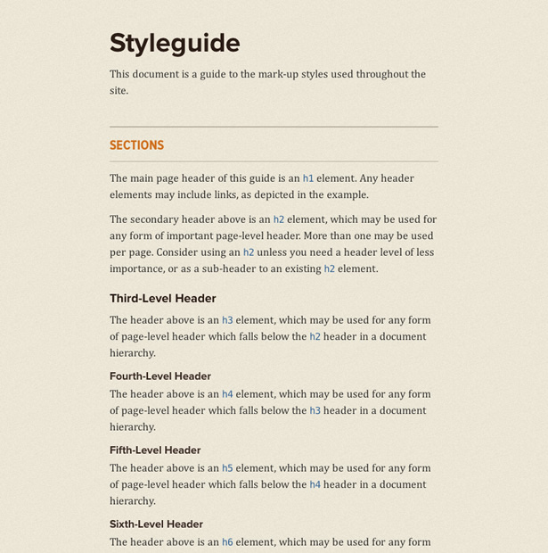
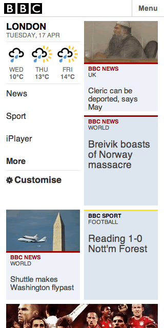

# Build a Responsive Website in a Week
## Day 2: Responsive Typography and Grids

In the second part of our responsive web design tutorial, Clearleft’s Paul Robert Lloyd will tell us how to translate static page designs into adaptable, fluid websites. So let go of those pixels and learn to love proportions!

* * *

* **Knowledge needed**: Intermediate CSS and HTML
* **Requires**: Text editor, modern browser, graphics software
* **Project time**: 1 hour (5 hours total)

* * *

For many years there was a debate among web professionals: fixed or fluid layouts? In many ways that debate has morphed into one where responsive layouts (with fluid underpinnings) are matched up against adaptive layouts (in which fixed layouts replace one another as the viewport changes).

The adaptive approach has some merit, but the chosen set of fixed layouts often reflect specific device characteristics – typically those representative of Apple’s current product lineup! But between these values, designs can look odd or simply fail to make the most of the available display area. In order to fully embrace the universal, unpredictable nature of the web, far more sensible to design layouts that can flex to fit any given display.

If you were on the fluid side of those earlier debates, then much of today’s tutorial will be old news to you. For those of us (including your humble author) who have been guilty of building fixed layout websites, we have some catching up to do! 

* * *

## Mobile first
Yesterday I talked about progressive enhancement: building a baseline experience before enhancing it for more capable devices. This approach ties in closely with the concept of [mobile first](http://netmagazine.com/features/mobile-first), a term first coined by [Luke Wroblewski](http://lukew.com/).

Luke points out that the use of mobile phones to view the web is rapidly overtaking that of traditional desktop computers. Users will increasingly experience our products on devices far more capable than their desktop counterparts; think touchscreens, location information and motion sensors. We can take advantage of these features, but as screens on these devices tend to be smaller, we need to employ a laser-like focus when deciding what content should appear on our websites.

With this in mind, we’ll base our initial CSS on the mobile-orientated designs we’ve been given, only adding more complex layouts as we introduce media queries (which we will look at in part four).

## Responsive typography
Typography forms the foundation of our design and will be the backbone of our CSS. Hopefully there is a clear hierarchy underpinning the design; far better to have three distinct heading styles than ten with subtle variation.

I like to begin projects by tackling typography as a distinct phase. I do this by producing a boilerplate document that contains all the major HTML elements, before creating a style sheet that resets default browser styles and redefines these elements based on our design. This ensures I’ve covered everything; from headings and paragraphs right down to tables and forms.

▲ _By creating a basic style guide, we can demonstrate how the base HTML elements will appear within the context of the overall design._

With that in mind, let’s start with the `<body>` element:

	body {
		color: #333;
		font: 100%/1.5 Cambria, Georgia, serif;
		background: #ece6d6 url(_assets/bg-light.png) repeat;
		margin: 0 auto;
		padding: 1em 20%; /* temporary */
	}

We’re using a base font size of 100%, which equates to 16px in most browsers, and funnily enough matches the size of the body copy in our design – this tutorial seems suspiciously well planned! We’ll also set-up the background styles and add some temporary padding. This will stop content from bumping up against the edges of the browser as we apply these initial styles.

Let’s look at another element. Inspecting our design, we can apply the following CSS to our level one headings:

	h1 {
		color: #2c1c16;
		font-family: 'Proxima Nova Bold',sans-serif;
		font-weight: bold;
		font-size: 28px;
	}

This seems fine and dandy, but that font size seems very specific. If we later change the base font size, or if a user resizes the text in their browser, the size of this heading won’t change. That’s not very responsive, is it?

## Responsive units
If there is one guiding rule I’ve discovered whilst developing responsive websites, it is that pixels are an indication of unresponsive thinking. If you think more broadly, pixels are a manifestation of screen-based devices, but who is to say our content will only appear on screens? You may laugh, but think about somebody printing out a webpage. Proportional measurements are far more akin to the universal foundations of the medium.

Thankfully, we have a couple to choose from:

* **em:** The em is intrinsically linked to type as this value is (usually) derived from the width of the ‘M’ in each typeface. Importantly, this measure is relative to computed font size of its parent. For example, if your body font size is 16px, a child element with a font size of 2em would be 32px.

* **%**: For other properties, particularly those affecting layout, the percentage is our friend. Again, this value is relative to the containing element. If you have a `
` with a width of 50%, and this contains a child element that also has a width of 50%, the calculated width of this child element will be 25% of the overall document width.

Care should be taken not to mix units; browsers aren’t smart enough to work out how wide an element should be if it has a percentage width, but padding set in ems (with maybe a border set in pixels). There are workarounds, but these are outside the scope of this tutorial. However, it’s for this reason that I tend to use ems to size typography and vertical measurements, and percentages for layout and horizontal measurements.

Returning to our heading, how then can we make this proportional? Well, we need to know two things: the context in which the heading sits, and the target size we’re aiming for (typically the size provided in the design comp). From these two values we can work out the resulting proportion:

	target / context = result

Get used to this formula – we’ll be using it *a lot*!

In the case of our heading, our context is the parent `<body>` element. This has a font size of 100% (which equates to 16px) whilst the target for our headline is 28px:

	28 / 16 = 1.75

Applying this formula to our heading style, we get the following:

	h1 {
		color: #2c1c16;
		font-family: 'Proxima Nova Bold',sans-serif;
		font-weight: bold;
		font-size: 1.75em; /* 28px */
	}

(I like to show the resulting pixel values inside comments so I can refer to them later.)

We also want to define the line height too; if a heading wraps this will stop it from becoming too bunched up. 32px should do it.

In dealing with proportions, it’s important to be aware of the changing context. Now that the size of this heading has changed, further values within this declaration need to be proportional to that value. To work out our line height, we can again use the magic formula:

	target / context = result
	32 / 28 = 1.1428571429

An ugly number, yes, but an accurate number! You can round it down, but I wouldn’t do so by anything more than four decimal places. We also want to add a 24px top margin. Again, we can use the formula:

	24 / 28 = 0.8571428571

Putting these values in place, we get our final heading style:

	h1 {
		color: #2c1c16;
		font-family: 'Proxima Nova Bold',sans-serif;
		font-weight: bold;
		font-size: 1.75em; /* 28px */
		line-height: 1.1428 /* 32px */
		margin-top: 0.8571em; /* 24px */
	}
	
(Note that you don’t need to declare a unit for the line-height property.)

Using ems can give type superhero-like powers, shrinking, scaling and adapting to whatever environment it finds itself. But with great power, come great… headaches. As em values are relative to their parent, we need to be careful when styling nested content. This is something you’ll get used to over time, but note the changing context as you use ems in your CSS rules.

Hopefully this will become less of a problem in the future thanks to a new measurement called the rem (short for root em). Rather than inherit the font size of a parent element, rems allow you to size text based on the value of the root element. [Jonathan Snook has written more about using this unit](http://snook.ca/archives/html_and_css/font-size-with-rem).

Once we’ve done the same for all our other base elements, we should have a document that looks as follows:

[View the style guide](demo/styles.html)

Returning to our pattern portfolio, we can see this starting to take shape too:

[View the pattern portfolio](demo/patterns.html)

Obviously, we will need to add further styles as we dig into the detail of each pattern, but by defining these basic styles, unstyled components will fall back to these defaults.

## Layout
Now that we’ve got the typography sorted, let’s look at some layout.

As we’re developing our ‘mobile’ styles first, it can be tempting to think that everything should be linearised. While in most cases this may be true, even on narrower screens it’s possible to experiment with something a little more interesting. A good example is the [beta version of the BBC’s mobile homepage](http://bbc.co.uk/blogs/bbcinternet/2012/03/launch_of_mobile_homepage.html) which uses a two-column grid very effectively:

▲ _Content needn’t be linearised on narrower screens._

Before we attempt something similar, let’s set up the padding that appears around our main content. This corresponds to the ’.document’ `
` we’ve added to our markup:

	

		<h1>Arriving in Las Vegas</h1>
		…
	
</!--/document-->

(Note: I’m using [ARIA roles](http://www.w3.org/TR/wai-aria/roles#document_structure_roles) to structure my document, with matching class names for styling hooks. If I wanted to be super fancy, I could omit the class names and use the attribute selector `div[role="document"]` instead).

In the narrower design comp, the padding is 16px (our target), whilst the overall width is 320px (the context). Again, we could use pixels:

	.document {
		padding-left: 16px;
		padding-right: 16px;
	}

But we want a fluid layout. So let’s use our magic formula again:

	16 / 320 = 0.05

As the resulting value we want is a percentage, we’ll multiply this number by 100, which gives us 5. This gives us the following:

	.document {
		padding-left: 5%;
		padding-right: 5%;
	}

Easy enough. Now let’s try something a *little* more complicated. One of the patterns in the design is an ordered list of thumbnails. These appear in rows of two, with a gutter appearing between each column, and margins below each item:

▲ _The thumbnails that appear on the homepage._

The HTML for these thumbnails is as follows:

	<ol class="media">
		<li class="media-item">
			<a href="#">
				
				<h2 class="title">Title of media item</h2>
				<time>10:04PM</time>
			</a>
		</li>
		…
	</ol>

First, we’ll reset our list styles:

	ol.media {
		list-style: none;
		margin: 0;
		clear: both;
		overflow: hidden; /* to clear floats */
	}

before adding styles for each list item:

	ol.media li.media-item {
		background-color: #fff;
		float: left;
	}

Each thumbnail, when the viewport is 320px wide, is 138px. But wait! 320px is no longer our context. Since we have added padding to the surrounding container, the available width is now 288px. This gives us the following calculation:

	(288 / 138) * 100 = 47.91666666667%

We can work out the value for our right and bottom margins (that are shown as 12px in the design) too:

	(288 / 12) * 100 = 4.16666666667%

This gives us our responsive thumbnails:

	ol.media li.media-item {
		background-color: #fff;
		margin: 0 4.16666666667% 4.16666666667% 0;
		width: 47.91666666667%;
		float: left;
	}
	ol.media li.media-item:nth-child(2n) {
		margin-right: 0;
	}

[View the pattern portfolio with our newly responsive thumbnails](demo/demo.html)

The one issue you’ll notice (perhaps as you resize the browser) is that the thumbnail images themselves aren’t responding to the changing width of their containers.

* * *

**Tomorrow:** We’ll discover a surprisingly simple fix for this issue, and continue to [make our layout even more fluid](../3-images-and-video/content.md).
