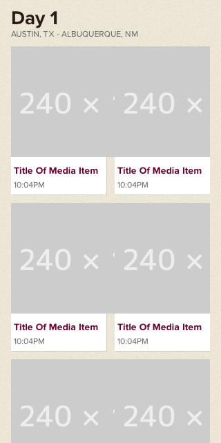
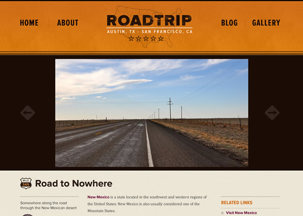

# Build a Responsive Website in a Week
## Day 3: Responsive Images and Video

In the third part of our responsive web design tutorial, Clearleft’s Paul Robert Lloyd looks at incorporating images and video into responsive layouts, and describes some of the problems in this area that still need solving.

* * *

* **Knowledge needed**: Intermediate CSS and HTML
* **Requires**: Text editor, modern browser, graphics software
* **Project time**: 1 hour (5 hours total)

* * *

Yesterday I described how we can craft fluid layouts, and suggested that to do this, we need to move away from pixels and instead embrace proportional units like ems and percentages.

This is all well and good when dealing with passages of text; if a column becomes too narrow then text can easily wrap on to a new line. But media assets like images and video have prescribed dimensions set in pixels. We can scale these down of course, but that means downloading larger files than necessary, and bandwidth can be expensive.

High definition (or Retina) displays pose another challenge. These displays pack a considerable number of pixels into a small area, allowing more detail to be shown. This can be a problem for high contrast imagery and iconography, which if not designed to match these native resolutions, can appear fuzzy and lack definition.

Today, I’ll look at these issues and provide insight into how we might tackle them. But it’s worth noting that this is a rapidly developing area, with new approaches emerging almost daily. This can be challenging – but exciting too!

* * *

## Scaling images within a fluid layout
Yesterday we created a fluid layout for our thumbnail pattern. Unfortunately, images within each item were not adapting to the changing layout, breaking outside their containers or leaving large areas of white space:

▲ _Thanks to some stubbornly unresponsive images, our thumbnails break._

Fortunately, there’s an easy way to fix this. First [discovered by Richard Rutter](http://clagnut.com/sandbox/imagetest/) (an early pioneer of fluid layouts), it involves adding the following rule to images you wish to scale with the layout:

	img {
		max-width: 100%;
	}

This rule tells browsers that an image should fill the width of its containing element, up until the point where it reaches 100% of its size. Simple!

There is one small caveat, however. For this CSS declaration to work, you can’t add a height attribute to your images. From a performance point of view, that’s not ideal (the sooner the browser knows what size to render an image, the less time it spends redrawing the page). Continue to include width and height attributes for images that don’t need to scale however.

## Responsive images
You’ll note that for these thumbnails, I’m using images that reflect the design of the desktop-orientated layout, and scaling them down for narrower viewports. This seems counter to everything we have described previously – this isn’t mobile first!

As with everything, it’s a question of judgement. We need to balance performance against maintainability – and our own sanity! For these thumbnails, the size differential is small enough (138px > 240px) that we can compensate for the file size in other ways. We will use the correct file format (JPEG can typically generate the smallest file size for photos) and apply an appropriate amount of compression. We will cover image optimisation in more detail during the final part of this tutorial.

▲ _Large images can appear on the media item page._

However, on the media item page, a photo can be anywhere between 288 and 800 pixels wide. Regardless of file format and other optimisations, our largest image could still be anywhere up to 300kb in size, taking several seconds (if not longer) to download over a 3G connection. This is a problem.

Ideally the browser would report the size of image it needs to display and the average amount of bandwidth available and we could serve an appropriately sized image best matching these constraints. Sadly, no browser does this, and there is nothing that hints at how this might work either (well, [not yet](http://www.w3.org/TR/netinfo-api/) anyway).

Such is the enormity of this problem, a few smart and talented developers have proposed some solutions. Many involve JavaScript, others use server-side detection; all have their advantages and trade-offs:

* **[Responsive images](https://github.com/filamentgroup/Responsive-Images):** Developed by [Scott Jehl](http://scottjehl.com/), this approach (a combination of server-side rewrites, cookies and JavaScript) aims to detect the width of the viewport before any images are downloaded. If the viewport is small, then the default small image is requested. Yet if the viewport is large enough, requests will be rewritten to a directory containing larger images, and these will be downloaded instead.

	Unfortunately, as browsers increasingly focus on performance – typically using techniques that involve prefetching of assets – this approach has become fragile. It also detects the display width to decide which images to load, yet it is not always true that a larger display warrants larger images.

* **[Adaptive images](http://adaptive-images.com/):** A PHP solution developed by [Matt Wilcox](http://mattwilcox.net/) and inspired by the work of Scott, this approach is compatible with existing markup and allows for multiple image sizes to be used. Again, it loads images based on screen resolution, which is not always an accurate test, and requires PHP and the GD library for it to work.

* **[Responsive enhance](https://github.com/joshje/Responsive-Enhance):** While many approaches have focused on trying to work out which image to download before a page loads, [Josh Emerson](http://joshemerson.co.uk/) has taken a different approach. Like other solutions, it involves referencing the smallest image in the markup. But rather than detect whether a larger image is required before the page is loaded, here the smallest image is downloaded regardless. Only once this has loaded (and if a larger image is required) does it get replaced with a higher resolution version. In many ways this is a modern take on the `lowsrc` attribute that mysteriously disappeared from HTML. Oh, how we long for its return.

[Jason Grisby has written more about this problem](http://blog.cloudfour.com/responsive-imgs/) and goes into fantastic detail about the pros and cons of some of the above solutions. Meanwhile, [Matt Marquis has suggested the need for a new HTML element](http://www.alistapart.com/articles/responsive-images-how-they-almost-worked-and-what-we-need/), and started [a community group at the W3C](http://www.w3.org/community/respimg/) to work out the details.

The long and short of it? This isn’t a solved problem. All we can do is decide which of the options mentioned above fits our needs the best. For this tutorial, we’ll choose the responsive enhance technique.

First, we need to link to the JavaScript file in the `<head>`:

	<head>
		…
		
		<title>Arriving in Las Vegas</title>
	</head>

Then, on our `` element, we need to add a new `data-fullsrc` attribute that references the source of the larger image:

	

We also need to add the following line of JavaScript below the image:

	

This tells the browser which image to replace, and at what viewport width to replace it. When JavaScript is disabled (or unavailable), users will get the smallest image. Otherwise, when the viewport is larger than 320px, the larger image will be displayed after the smallest one has finished downloading.

Finally, we need to override the default styling of images. For the detection to work, we need the smaller image to scale larger than its native size. We can do this as follows:

	img.media-object {
		margin: 0 auto;
		width: 100%;
		max-width: 50em; /* 800px */
	}

Again, this is not a perfect solution (especially as we can only reference one additionally sized image), but it’s far better than serving larger images regardless.

## Resolution independent images
Images don’t just exist within markup of course: we can also reference them from CSS. Things are a little easier here, as media queries mean we can choose which images to show in different layouts.

As many of our background images in CSS will be icons, now is a good time to touch on high resolution displays, and in particular, two methods which allow us to use resolution-independent icons:

* **SVG image sprites:** On an increasingly pixel-less web, Scalable Vector Graphics (SVG) are enjoying something of a revival after years in the wilderness. With good support in most modern browsers – including IE9 and above – we can use this format in a number of ways. We can reference it from an `` element, we can embed SVG code directly in our markup, and we can reference it from within CSS. David Bushell has [documented a technique that uses SVG-based image sprites](http://coding.smashingmagazine.com/2012/01/16/resolution-independence-with-svg/), and it’s well worth a read. 

* **Icon fonts:** Another means of including scalable icons is with specially designed web fonts that include icons rather than letters and numbers. This means we can style icons in the same way we do for text, and enjoy vector based iconography, too. Jon Hicks [has written more about icon fonts on 24 ways](http://24ways.org/2011/displaying-icons-with-fonts-and-data-attributes).

## Ratio ga ga
Okay, enough about images – let’s talk about video. Thankfully, making videos responsive is less problematic. Such is their size, approaches to serving videos in a bandwidth-friendly manner are more commonplace, be that via streaming or the many different compression codecs available. And of course, videos should only start downloading once you hit play.

But, we want our videos to scale within the confines of our layout. If we are using native HTML5 video, we can again use the following CSS:

	video {
		max-width: 100%;
	}

However, embedded objects (`<iframe>`, `<object>`, `<embed>`) behave differently. If we add the following rule to our embed:

	iframe.media-object {
		max-width: 100%;
	}

the video may not maintain the correct ratio as it scales, or it could simply refuse to flex at all:

▲ _Video embed resized in the wrong proportions._

This is because embedded objects aren’t able to report the ratio of the video they contain. In order to get round this problem, we need to place the embed inside a container that has the correct ratio, and set the embed to be 100% wide and tall (an approach [first discovered by Thierry Koblentz](http://www.alistapart.com/articles/creating-intrinsic-ratios-for-video/)).

First, we need to add a container around our embed:

	

		<iframe class="media-object" src="http://player.vimeo.com/video/40493662"/>
	

Then we can then style the wrapper as follows:

	.media-object-wrapper {
		padding-bottom: 56.25%;
		width: 100%;
		height: 0;
		position: relative;
	}

The `padding-bottom` value is what gives this wrapper its ratio. As our embedded videos have been recorded using a 16:9 aspect ratio, their height is 56.25% of the width (9/16=0.5625). You’ll notice that we’ve also given this element relative positioning; this is so we can absolutely position the enclosed `<iframe>` and have it ignore this padding:

	.media-object-wrapper iframe.media-object {
		width: 100%;
		height:	100%;
		position: absolute;
	}

And there you have it. Our video embeds now respond to the layout just as beautifully as our images:

▲ _Our embedded video now resizes correctly._

[View our responsive video in our pattern portfolio](demo/demo.html)

Still, as we examine the fluidity of our pattern portfolio, we can quickly see that although it scales, there are points where we would ideally make the layout a little smarter, adapting it as the width of the browser increases.

* * *

**Tomorrow:** We’ll look at the final component of responsive web design: [media queries](../4-media-queries/content.md).
