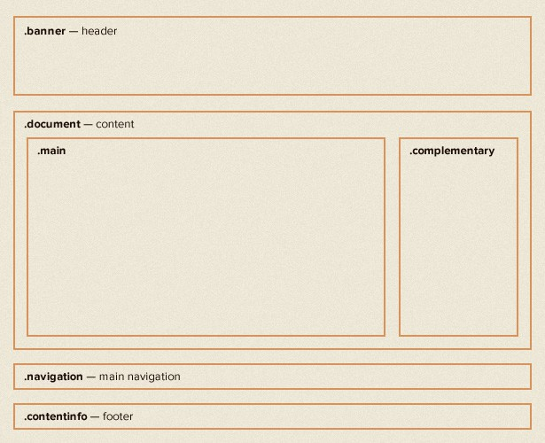
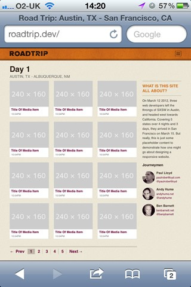
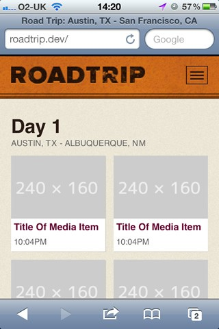

# Build a Responsive Website in a Week
## Day 4: Getting to Grips With Media Queries

In the penultimate part of our responsive web design tutorial, Clearleft's Paul Robert Lloyd explains how media queries work, and describes a device-agnostic approach to breakpoints.

* * *

* **Knowledge needed**: Intermediate CSS and HTML
* **Requires**: Text editor, modern browser, graphics software
* **Project time**: 1 hour (5 hours total)

* * *

A relatively new part of the CSS specification, media queries are undoubtedly the most exciting aspect of responsive web design and an area ripe for further experimentation.

Having accepted the need for adaptive layouts, some have seen media queries as a means to retrofit adaptive layouts on to existing fixed-width sites. Among those who have embraced responsive layouts, many have done so from the perspective of the desktop, hiding content and features as the viewport narrows.

Throughout this tutorial, we've taken an alternative, mobile first, approach. Now, as we look to include media queries, we can think about *adding* features as screen real estate increases, safe in the knowledge that the markup and design underpinning our site provides a respectable baseline.

Today, we will move beyond our pattern portfolio and build the individual pages required for our website. In doing so, we will see how media queries are constructed, and implement them in a truly responsive way.

* * *

## Adding media queries
With the components in our pattern portfolio complete and working outside the confines of any layout, it's time to move them into the different pages that make up our site.

We'll start with our homepage. From the desktop-orientated design, we can see that in wider viewports our layout should appear as follows:

▲ _Our homepage is composed of a header, main navigation and footer, with the content area divided into two columns: the main column taking up three quarters of the width while the complementary column takes up the remaining quarter._

Taking measurements from our design, we can describe the document area in CSS as follows:

	.document {
		padding: 0 5%;
	}
	.main {
		width: 74.242424242424%; /* 784/1056 */
		float: left;
	}
	.complementary {
		width: 22.727272727273%; /* 240/1056 */
		float: right;
	}

As we learnt in the second part of this tutorial, we're using the following formula to calculate the percentage width of these columns:

	(target / context) * 100 = result

When we resize our browser, we'll see that our desktop layout scales from the smallest size screen to the largest. Of course, at small sizes the columns are too narrow and line lengths so short that the content is hard to read. We only want this layout when there is enough space available for it to work.

This is where media queries come in. Assuming that this layout should only take effect when the browser is wider than 768px, we can add the following CSS:

	.document {
		padding:0 5%;
	}
	@media screen and (min-width:768px) {
		.main {
			width:74.242424242424%; /* 784/1056 */
			float:left;
		}
		.complementary {
			width:22.727272727273%; /* 240/1056 */
			float:right;
		}
	}

Now, when the viewport is narrower than 768px, everything inside the media query will be ignored. It will be ignored by any browser that doesn't support media queries too.

## Anatomy of a media query 
To understand what's happening here, let's look at how a media query is constructed. We can split it into two parts:

* **@media screen:** The first part of a media query is the **media type**. You may recognise this syntax if you've ever included print styles in your CSS. You may also recognise the type name from the `media` attribute on the  `<link>` element. That is because both accept the [approved set of media types](http://www.w3.org/TR/CSS2/media.html) found in the CSS 2.1 specification.

* **(min-width:768px):** The second part is the **query**. This includes the *feature* to be queried (in this case the minimum width of the viewport) and the corresponding *value* to test for (768px).

When we talk about responsive web design, there's a tendency to focus on width, but there are other features we can test for too:

* **(min-|max-)width** and **(min-|max-)height:** These allow us to query the width and height of the viewport (i.e. the browser window).

* **(min-|max-)device-width** and **(min-|max-)device-height:** These allow us to query the width of the entire display. In my experience, it's usually more sensible to base layouts on the viewport rather than the display.

* **orientation:** You can immediately think of the possibilities here; think of apps that show different content based on the orientation of your phone – the same is possible on the web.

* **(min-|max-)aspect-ratio:** This allows us to adapt layouts based on the ratio of the browser window…

* **(min-|max-)device-aspect-ratio:** …and this allows us to do the same based on the device aspect ratio. Owen Gregory wrote [a wonderful article](http://24ways.org/2011/composing-the-new-canon) last year that explored how we can use this query to tie our designs to the devices they appear on.

* **(min-|max-)monochrome:** We can also test whether a device has a monochrome display or not. Imagine how useful this would be if Amazon's e-ink Kindle devices didn't lie and report their screens as colour!

The final part of our query is possibly the most useful. By using **and**, we can test for multiple features in one query. For example:

	@media screen and (min-width: 768px) and (orientation: landscape) {
		…
	}

As you can see, media queries can help us build fairly compelling experiences – and I've only touched the surface. If you're looking for some light bedtime reading, you could do worse than to [read the W3C media query specification](http://www.w3.org/TR/css3-mediaqueries/#media1) which describes all the features we can test for.

## One more thing…
Even though we've included media queries in our CSS, if we view our site on a mobile device, you'll notice that our site is still being rendered as if the display was wider than 768px.

▲ _Our website doesn't appear responsive, even though we've added media queries._

To understand why this is happening, we need to take a brief history lesson.

When the original iPhone was announced in 2007, one of its big selling points was the ability to browse the 'real web', even if that meant fixed-width desktop-orientated sites that needed to be squashed down to fit on its small screen. The iPhone was able to do this by reporting its display as being 980px wide, before scaling webpages down to fit its 320px-wide screen.

But the iPhone was introduced before the advent of responsive design. Now that authors are designing sites designed for mobile, this feature is less useful. Thankfully, Apple included a means of bypassing this behaviour, and since it's been adopted by other manufactures, it has become almost a *de facto* standard. It simply involves adding a single `meta` element to our markup:

	<meta name="viewport" content="initial-scale=1.0, width=device-width"/>

This tells viewport-aware browsers that a website shouldn't be scaled down, and that the width of the browser window should be treated the same as the overall device width. Once we've added this line, our website will appear with the intended layout:

▲ _The correct layout appears once we've added the viewport meta element._

## Choosing breakpoints
Let's return to our media query:

	@media screen and (min-width: 768px) {
		…
	}

Values at which a layout adapts are commonly referred to as breakpoints. If you recall, in part two I said that using pixels is an indication of unresponsive thinking, yet here I have chosen 768px, probably because it's the width of a familiar device.

Instead of choosing breakpoints based on the characteristics of popular devices, it can be more effective to look at values derived from our content, for example, comfortable line lengths for reading or the maximum size of an image.

With our type being sized using ems, it seems sensible for our media queries to use ems as well. In fact doing so has an additional benefit. When a user resizes text in the browser, pages will adapt to use smaller breakpoints. Not only will our website adapt based on the size of the viewport, but the size of the font too. In fact, it was only when I saw [Jeremy Keith](http://adactio.com/) demonstrate em-based media queries that I realised how powerful they could be.

While our design may provide some indication of possible breakpoints, often the best way to choose them is through experimentation. By adjusting the width of the browser window, I've decided that 800px is a good width at which to swap to a more complex layout.

How do we 800px express in ems though? Again, we can use our formula, but what is the context? When calculating ems for media queries, the context is always the browser's default font size *regardless of whether this value has been overridden in your CSS*. This default is typically 16px, which gives us:

	800 / 16 = 50

We can now update our media query like so:

	@media screen and (min-width: 50em) { /* 800px */
		…
	}

## Adjusting our thumbnails
You will remember that in part 2 we styled our thumbnails to be responsive. Yet once the images within these thumbnails reach their full width, an area of white space appears to the right of each image. Again, media queries allow us to fix this.

Here is our original CSS:

	ol.media li.media-item {
  		background-color: #fff;
  		margin: 0 4.16666666667% 4.16666666667% 0;
		width: 47.91666666667%;
		float: left;
	}
	ol.media li.media-item:nth-child(2n) {
		margin-right: 0;
	}

The point at which this white space appears is just as the browser grows wider the 560px. We'll choose this value at which to swap to showing three thumbnails per row. We can do that by adding the following CSS:

	@media screen and (min-width: 35em) {
		.media-item {
			width: 30.612244897959%; /* 240/784 */
			margin: 0 4.081632653061% 1.1429em 0; /* 0 32/784 16px 0 */
		}
		.media-item: nth-child(3n) {
			margin-right: 0;
		}
	}

Note that we don't need to rewrite all the styles required for the thumbnail inside this media query, only the parts we wish to adapt.

Viewing this change in the browser, you'll note that there is no margin to the right of every second thumbnail. This is because the following CSS rule still remains active:

	ol.media li.media-item:nth-child(2n) {
		margin-right:0;
	}

We need to modify the CSS within our media query to reset that value:

	@media screen and (min-width: 35em) {
		.media-item {
			width: 30.612244897959%; /* 240/784 */
			margin: 0 4.081632653061% 1.1429em 0; /* 0 32/784 16px 0 */
		}
		.media-item:nth-child(2n) {
			margin-right: 4.081632653061%;
		}
		.media-item:nth-child(3n) {
			margin-right: 0;
		}
	}

When creating media queries, always be aware of inheritance issues like this.

## Not just width
It's important to think about media queries not just in terms of width, but other variables too. For example, the video on our media item page is partially hidden when the viewport height decreases. We have the technology:

	.media-object-wrapper {
		padding-bottom: 56.25%;
		width: 100%;
		height: 0;
		position: relative;
	}
	@media screen and (max-height:35em) and (orientation:landscape) { /* 560px */
		.media-object-wrapper {
			width: 60%;
			padding-bottom: 33.75%;
		}
	}

I've even included an orientation query to finesse this behaviour further.

We can follow a similar approach for the other parts of our design, swapping in a larger version of the header and moving the navigation links to the top of the page once space becomes available.

* [View our responsive homepage](demo/demo.html)
* [View our responsive media item page](demo/media-item.html)

And there we have it! We've built a responsive website – and with a day to spare! Well, not quite. Flexible layouts, images and media queries is only the start of the responsive design process.

* * *

**Tomorrow:** In the final part of this tutorial, we'll go beyond responsive web design, and look at [how we can build truly responsive websites](../5-going-further/content.md).
