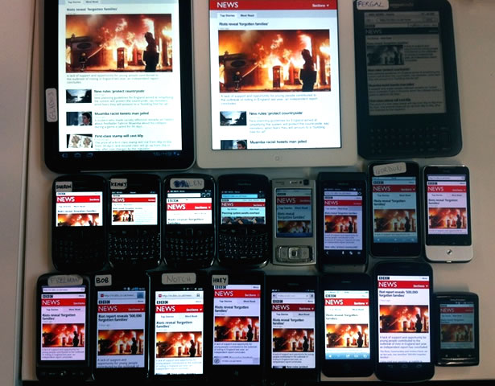
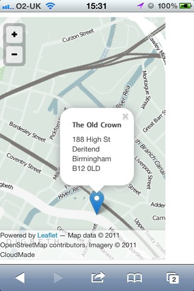
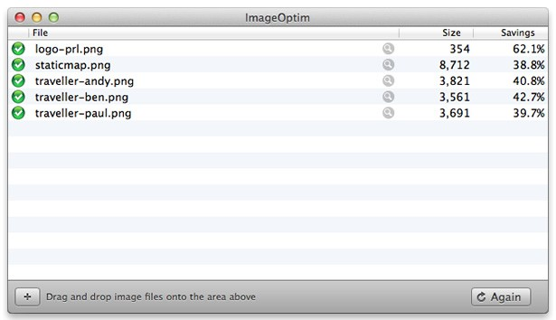

# Build a Responsive Website in a Week
## Day 5: Going further with Responsive Web Design

In the final part of our responsive web design tutorial, Clearleft’s Paul Robert Lloyd explains how there is more to a responsive design than just flexible layouts, images and media queries.

* * *

* **Knowledge needed**: Intermediate CSS and HTML
* **Requires**: Text editor, modern browser, graphics software
* **Project time**: 1 hour (5 hours total)

* * *

Although responsive web design can help us craft compelling adaptive experiences, it’s no silver bullet; this approach won’t automatically deliver websites that can cater for every conceivable device and use case – but it’s a start.

This is especially true given that most responsive sites only adapt based on the width of the browser (and then infer device and context based on this value). Hopefully this will change once we’re able to test for capabilities like connection speed and input method. It’s early days and we’re still figuring this stuff out.

I’ll conclude this series by looking at how we can improve the responsiveness of our sites by testing across a wide range of devices and through continuous design iteration based on usage.

* * *

## Testing
Throughout this tutorial I have suggested adjusting the browser window to see how well a design responds. While useful as a lightweight test, this is neither the reason for – or how most users will experience – a responsive site. Like any good design, how a website adapts should be invisible to the user. [Trent Walton echoed this sentiment](http://trentwalton.com/2011/05/10/fit-to-scale/) when he said “my website will meet you wherever you are – from mobile to full-blown desktop and anywhere in between”.

To properly assess how users will ‘meet’ our website, we need to experience it ourselves. We can only make judgements about the suitability of a design based on real world usage. Testing isn’t an activity to be performed at the end of each project either; it’s an integral part of the development process.

### Desktop browsers
We’re accustomed to testing across a range of different desktop browsers and responsive sites are no different. We likely have a suite of browsers installed, and maybe even a virtual machine so that we can test on different operating systems too.

This should confirm that our code works as intended across all modern browsers. We are helped in this regard thanks to Firefox 3.5+, Opera 9.5+, Safari 3+ and Chrome all supporting media queries. Yet the usual suspect remains: media queries have only been recognised by Internet Explorer since version 9. But by building our website assuming mobile first, browsers that don’t recognise media queries will still see our content – albeit with a simplified layout.

If you want your desktop-orientated layout to appear in earlier versions of Internet Explorer, you have two options.

The first (and simplest) is to use a JavaScript polyfill. I like [respond.js](https://github.com/scottjehl/Respond) created by Scott Jehl. Not only is this script small (4kb), but it supports em-based media queries as well. Using conditional comments in the `head` means only the right versions of IE use this script:

	<!--[if lt IE 9]>
		
	<![endif]-->

The second option is to move complex layout styles into a separate CSS file, linking to this from the `head` with a media query inside the `media` attribute. This gives us layout styles that we can then repeat (without the media query) within a conditional comment:

	<link rel="stylesheet" type="text/css" href="style.css" media="screen, handheld" />
	<link rel="stylesheet" type="text/css" href="layout.css" media="screen  and (min-width: 40.5em)" />
	<!--[if (lt IE 9)&(!IEMobile)]>
		<link rel="stylesheet" type="text/css" href="layout.css" />
	<![endif]-->

Note that this conditional comment needs to exclude `IEMobile` so that Internet Explorer on Windows Phone continues to ignore the complex layout styles.

### Simulated device testing
We should also test responsive sites on mobile browsers too. As this can be quite time consuming, a number of applications and websites have been created to help us test breakpoints and simulate slow network connections on the desktop:

* **[Charles Proxy](http://www.charlesproxy.com/):** This application for PC, Mac and Linux helps you examine HTTP traffic between a machine and the Internet, as well as simulate slower connections.

* **[Network Link Conditioner](http://mattgemmell.com/2011/07/25/network-link-conditioner-in-lion/)** Matt Gemmell discovered a useful utility included in the Mac OS X Lion Developer Tools that allows you to simulate different network conditions.

* **[Slowy](http://slowyapp.com/)** Slowy is a similar tool, but arguably better designed than its Apple equivalent!

* **[responsivepx](http://responsivepx.com/):** There are a number of websites that will allow you to test breakpoints within a single browser window, but this tool by [Remy Sharp](http://remysharp.com/) is one of my favourites.

* **[Apptus](http://itunes.apple.com/us/app/aptus/id510487565)** This Mac OS X application created by [Alex Morris](http://mistermorris.tumblr.com/) helps you test responsive sites against a range of display resolutions that you can customise and add to over time. This can be very useful when developing a local site offline.

Most device manufactures also provide emulators that we can add to our desktop-based test suite. Visit the following sites for more details:

* [Apple xCode](https://developer.apple.com/xcode/)
* [Android SDK](http://developer.android.com/sdk/)
* [MSDN App Hub for Windows Phone](http://create.msdn.com/)
* [BlackBerry Developer](https://developer.blackberry.com/)
* [Nokia Developer](http://www.developer.nokia.com/)

## Device advice
As useful as simulators and emulators can be, they can only do that; simulate. There is no substitute for testing websites on devices in the real world. Here we can experience varying network speeds and connectivity issues, the changing context of use (how differently one might use a site if on the train rather than sitting on a sofa) and direct manipulation via touch.

▲ _The device testing lab used during the development of the BBC News mobile site._

This means having a suite of devices to test on. At minimum this should represent all contemporary mobile operating systems (iOS, Android, Windows Phone, BlackBerry OS, Symbian) and include previous versions too. Fragmentation around the Android platform makes it difficult to suggest one particular version you should test on, but if a site works on 2.1 (Eclair) then it will likely work on later versions. Be sure to install [Opera Mini](http://www.opera.com/mobile/) on these devices and test on this too.

For an example of just how broad a test suite can be, [David Blooman has described the device lab](http://mobiletestingfordummies.tumblr.com/post/20056227958/testing) used by BBC during the redesign of their responsive news website. Luke Wroblewski also [asked a number of mobile developers to list which phones they test with](https://bagcheck.com/blog/22-mobile-device-testing-the-gear) on Bagcheck. Finally, tools like [Adobe Shadow](http://labs.adobe.com/technologies/shadow/) and [showoff.io](https://showoff.io/) make it easier to test designs across many devices at the same time.

The common theme here is the need to own a huge array of devices; with more being added as new devices are launched. To be honest, I’m a little uncomfortable with this situation. Not only does it present a potential barrier to entry for anyone wanting to build responsive websites, but it encourages the purchase of yet more devices and gadgets. Once you’ve watched [The Story of Stuff](http://www.youtube.com/watch?v=gLBE5QAYXp8), consumerism can feel a little sickening.

Thankfully, there are other ways we can integrate device testing into our workflow that are less expensive and a little friendlier to the environment too:

* **Test on your own device:** This is a given, but testing on a device that you always have on you can be immensely valuable.

* **Test on friends devices:** It’s likely you have friends with models of mobiles, tablets and ebook readers you don’t own. Make a point of testing sites you’re currently developing on their devices whenever you can.

* **When friends upgrade, buy their old devices:** Again, friends may be a useful source of older devices which you can build a device library around. When they upgrade, offer to buy their old phones – if you’re lucky they may even give them to you for free!

* **Find older devices on eBay:** This can be a useful source of cheap, second-hand phones, great for building up a collection of older models.

* **Organise a local shared device library:** Perhaps owned or operated by a local design agency, or situated within a co-working space, a shared facility can be a fantastic way for many to get the benefits of a large device library without the expense. It may also encourage discussion about common issues being seen in different devices, and possible workarounds for how to solve them.

The key thing to remember here is that *any testing is better than no testing*. Build up a test suite as large as you can afford, and find opportunities to test on other devices whenever you can.

## Performance and optimisation
Only by testing on a range of browsers and devices will you pick up certain issues. Varying screen resolutions and pixel densities may require adjusting target areas around links. And you may even find that some interactive elements are located in difficult to reach areas on certain phones.

When I was designing [my personal site](http://paulrobertlloyd.com/), I spent a few weeks viewing it on trains, in the street and in coffee shops while using their WiFi. By doing this I noticed that fonts took a long time to load, my headings took up too much space and that it was difficult to scroll past embedded ’slippy’ maps. So I implemented Google’s WebFont Loader to improve font loading, reduced the size of headings when they appeared in narrower viewports and added a right-hand margin to the side of every map.

▲ _Only by testing my personal website in the wild was I able to discover issues like the inability to scroll past embedded ’slippy’ maps. To fix this I added a right-hand margin, making them easier to scroll past._

Regardless of device, the biggest improvements you can make will be those effecting the performance of your site. Performance could be an entire article in and of itself, but the three key things you’ll want to focus on are: caching, the size of the files and the number of HTTP requests being made. Tools like [Google Page Speed](https://developers.google.com/pagespeed/), [ySlow](http://yslow.org/) and [WebPagetest](http://webpagetest.org/) can tell us how well pages are performing and suggest areas for improvement.

Simple things like using CSS gradients instead of background images, embedding small images into our CSS files using [data URIs](http://css-tricks.com/data-uris/) and concatenating CSS and JavaScript files can reduce the number of HTTP requests. Moving references to JavaScript files to the end of the document can speed up the page rendering too.

We can reduce the size of image assets by using appropriate file formats and acceptable levels of compression. Techniques such as blurring out the background of images (giving them a depth of field effect) and running them through applications like [ImageOptim](http://imageoptim.com/) can reduce their size even further. We can also speed up the delivery of assets by hosting them on a CDN.

▲ _Utilities like ImageOptim can reduce the file size of images._

Techniques like conditional loading – where certain parts of a page are only shown when requested by the user – are likely to grow in popularity, especially on larger sites. For example, on our media item page, we may decide that the related links are not essential content. Instead of including it in the page source, we can instead provide a link that requests this content only when clicked. On larger displays, this content would be loaded by default. [Jeremy Keith has written more about this technique](http://24ways.org/2011/conditional-loading-for-responsive-designs) on 24 ways.

## Conclusion
Throughout this tutorial I have introduced the responsive design process, and given you some insight into the surrounding discussion that has emerged from it.

We have discovered that responsive web design is a form of progressive enhancement, and as such, a continuation of our maturing understanding of the web as a universal medium. We have also learnt to embrace proportions, and the formula that underpins fluid layouts. There are still problems however, especially around images, but continual experimentation, based on testing and usage will guide the way.

And with that, we have our finished website: <http://paulrobertlloyd.github.io/roadtrip>

But a website is never finished. With that in mind, I invite you to clone, fork and contribute to the code behind this demo site on Github:

<https://github.com/paulrobertlloyd/roadtrip/>
